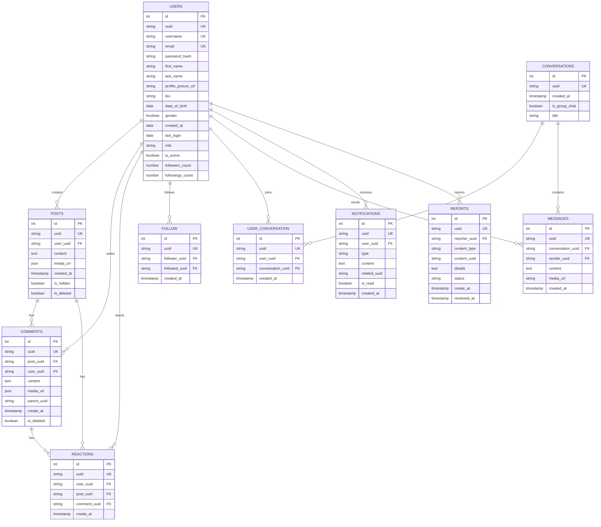

# Socialmedia

This graduation project is a multilingual social media platform powered by a modular backend architecture and RESTful APIs.

The system handles data management, authentication, real-time communication, and content moderation to support posting, interaction, and chat features.

---

## Report

This project was developed as a graduation thesis at the University of Science and Technology — The University of Danang.

**Title:** Social Media System Integrated with Negative Content Prevention Technology

**Author:** Đinh Hoàng Phi Hùng · Student ID: 102210114 · Class: 21T-DT2

**Major:** Software Engineering — Information Technology

**Advisor:** ThS. Nguyễn Thế Xuân Ly

**Institution:** Faculty of Information Technology, University of Science and Technology, The University of Danang

**Year:** 2025

The full graduation thesis report is available here:
[Graduation Thesis Report (PDF)](https://drive.google.com/file/d/1Ue4nHwUSQQDds60lackH7RDCsJ0p5kNf/view?usp=sharing)

---

## Tech Stack

| Technology                                                          | Version | Purpose                                     |
| ------------------------------------------------------------------- | ------- | ------------------------------------------- |
| [NestJS](https://nestjs.com)                                        | 11.x    | Core backend framework (Node.js)            |
| [TypeScript](https://www.typescriptlang.org)                        | 5.3.x   | Type safety                                 |
| [TypeORM](https://typeorm.io)                                       | 0.3.x   | Database ORM and migrations                 |
| [MySQL](https://www.mysql.com)                                      | -       | Primary database                            |
| [Redis](https://redis.io)                                           | 4.7.x   | Caching and session storage                 |
| [Socket.IO](https://socket.io)                                      | 4.8.x   | Real-time communication (WebSockets)        |
| [JWT](https://jwt.io)                                               | 9.x     | Authentication tokens                       |
| [Passport](https://www.passportjs.org)                              | 0.7.x   | Authentication strategies                   |
| [Google Auth Library](https://developers.google.com/identity)       | 10.x    | Google OAuth integration                    |
| [DigitalOcean Spaces](https://www.digitalocean.com/products/spaces) | -       | Object storage (S3-compatible, via AWS SDK) |
| [Swagger](https://swagger.io)                                       | 11.x    | API documentation                           |
| [Nodemailer](https://nodemailer.com)                                | 6.x     | Email service                               |

---

## Domain Driven Design

The backend follows a **Domain Driven Design (DDD)** approach, where each feature module is self-contained and organized into four distinct layers. This keeps business logic decoupled from infrastructure concerns and makes each module independently maintainable.

### Layered Architecture

```
src/
├── modules/
│   └── <module>/
│       ├── presentation/          # HTTP interface — controllers and DTOs
│       │   ├── controller/
│       │   └── dtos/
│       ├── application/           # Use-cases and mappers (orchestration logic)
│       │   ├── use-cases/
│       │   └── mapper/
│       ├── domain/                # Domain contracts — repository interfaces
│       │   └── interfaces/
│       ├── infrastructure/        # Database — ORM entities and repository implementations
│       │   ├── orm/
│       │   └── repositories/
│       └── <module>.module.ts
└── shared/                        # Cross-cutting concerns shared across modules
    ├── base/
    ├── decorators/
    ├── dtos/
    ├── enum/
    ├── guards/
    ├── helpers/
    ├── infrastructure/
    │   ├── config/
    │   ├── database/
    │   │   ├── migrations/
    │   │   └── seeds/
    │   └── orm/
    ├── repositories/
    ├── strategies/
    ├── types/
    └── utils/
```

### Layer Responsibilities

| Layer          | Folder            | Responsibility                                                  |
| -------------- | ----------------- | --------------------------------------------------------------- |
| Presentation   | `presentation/`   | Receives HTTP requests, validates input DTOs, returns responses |
| Application    | `application/`    | Implements use-cases; coordinates domain objects and services   |
| Domain         | `domain/`         | Defines repository interfaces; contains pure business contracts |
| Infrastructure | `infrastructure/` | Implements repository interfaces using TypeORM entities         |
| Shared         | `shared/`         | Guards, decorators, enums, base classes, config, migrations     |

### Data Flow

```
HTTP Request
    │
    ▼
Controller (Presentation)
    │  validates DTO, calls use-case
    ▼
Use-Case (Application)
    │  applies business logic via domain interfaces
    ▼
Repository Interface (Domain)
    │  abstracts persistence
    ▼
Repository Implementation (Infrastructure)
    │  queries database via TypeORM
    ▼
ORM Entity / MySQL
```

---

### Database Diagram



---

## Module Structure

| Module               | Description                                                                         |
| -------------------- | ----------------------------------------------------------------------------------- |
| `AuthModule`         | User registration, login, logout, JWT access/refresh token management, Google OAuth |
| `UsersModule`        | User profile management, avatar update, account settings                            |
| `FollowModule`       | Follow/unfollow users, retrieve followers and following lists                       |
| `PostsModule`        | Create, read, update, delete posts; manage post visibility and media                |
| `CommentModule`      | Add, edit, delete comments on posts; nested comment support                         |
| `ReactionsModule`    | Like/unlike reactions on posts and comments                                         |
| `MessageModule`      | Direct messaging between users, conversation management                             |
| `SocketModule`       | WebSocket gateway for real-time events (messages, notifications)                    |
| `NotificationModule` | Real-time notification delivery and read/unread status management                   |
| `ReportModule`       | Report inappropriate posts or users; admin moderation workflow                      |
| `AnalyticsModule`    | Dashboard statistics for admin (users, posts, reports overview)                     |
| `StorageModule`      | File upload to DigitalOcean Spaces (images, avatars, media attachments)             |
| `RedisModule`        | Redis client setup for caching, token blacklisting, and pub/sub                     |

---

## Environment Variables

Create a `.env` file based on `.env.sample` file

---

## Getting Started

### Prerequisites

- Node.js >= 20
- npm
- MySQL
- Redis

### Installation

```bash
npm install
```

### Development

```bash
npm run start:dev
```

### Build & Production

```bash
npm run build
npm run start:prod
```

---

## Goals

- Learned how to structure, organize, and maintain a scalable backend codebase using modular architecture
- Applied Domain Driven Design (DDD) principles by separating each module into Presentation, Application, Domain, and Infrastructure layers
- Defined domain contracts through repository interfaces, keeping business logic decoupled from persistence and infrastructure concerns
- Designed and implemented RESTful APIs following best practices
- Implemented JWT-based authentication with access/refresh token rotation
- Integrated real-time features using WebSockets (Socket.IO) for messaging and notifications
- Managed file storage with Storage of Digital Oceans for user-uploaded media
- Implemented content moderation and admin dashboard functionalities
- Containerized the application with Docker and set up CI/CD pipelines for automated testing and deployment to a remote server
- Improved problem-solving skills through handling edge cases and performance bottlenecks
